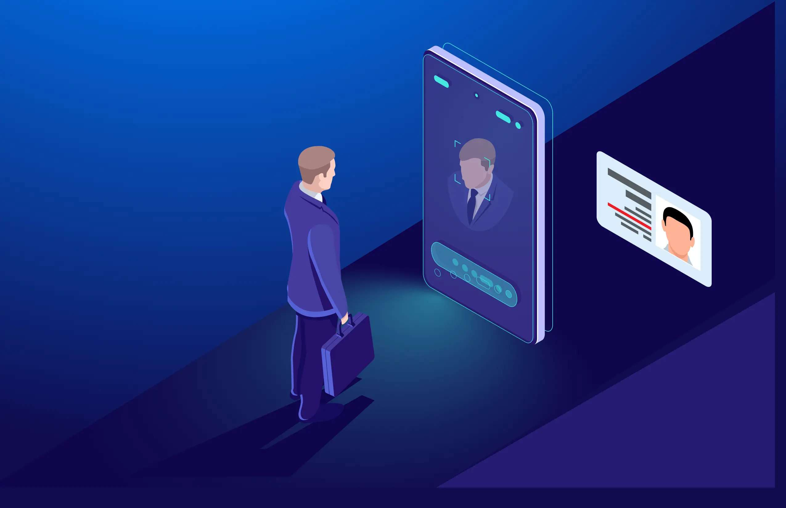

# face recognition attendance system
 A facial recognition attendance system can be employed to recognize employees and confirm or refuse access upon entry. This is especially important if your company has pricey inventory or sensitive data.
 
 
 
 
   

   

